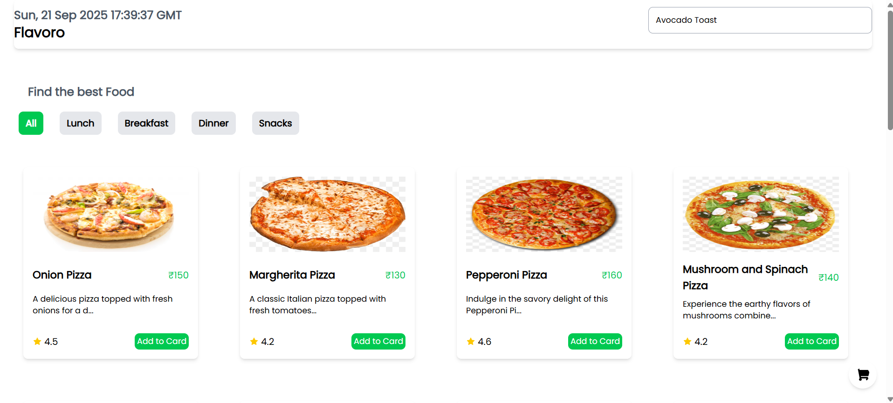
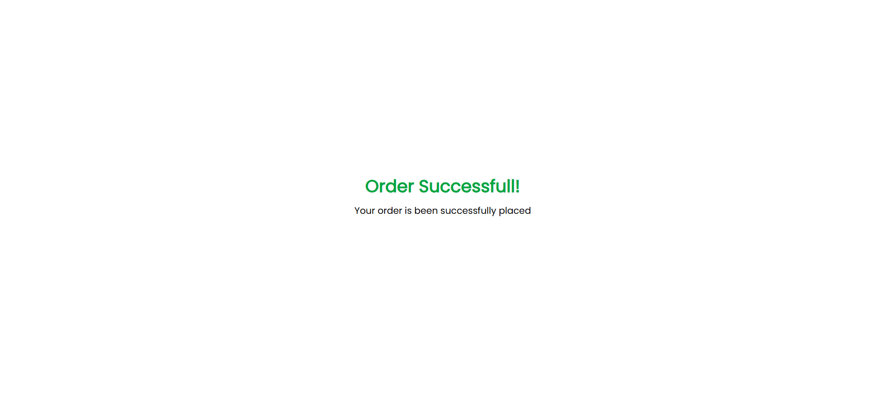

Flavoro 🍔🍕🥗

A modern food ordering web application where users can explore different food categories, add items to their cart, and manage their order seamlessly.

🚀 Features

📂 Categories: Browse by All, Breakfast, Lunch, Dinner, Snacks

🔍 Search: Quickly find your favorite food by category

🏠 Home Page: Showcasing all available food items

🛒 Cart Management: Add, update quantity, and remove items from the cart

✅ Success Page: Display confirmation after checkout

🎨 Responsive UI: Styled with Tailwind CSS for modern design

🛠️ Tech Stack

React.js – UI framework

React Router DOM – Page navigation

Redux Toolkit – State management (cart, products, etc.)

React Icons – Icons for UI

Tailwind CSS – Styling

JavaScript (ES6+) & JSX

## 📸 Screenshots

### 🏠 Home Page

### 🛒 Cart Page

### ✅ Success Page

⚙️ Installation & Setup

Clone the repo
https://github.com/Princeydv83032/Favoro-food-app.git

Install dependencies
npm install

Run the app
npm run dev

## 📂 Folder Structure

flavoro-food-app/
│── node_modules/ # Dependencies (auto-generated)
│── public/ # Static public assets (favicon, index.html, etc.)
│── screenshots/ # Screenshots for README (ignored in build)
│
├── src/ # Main source code
│ ├── assets/ # Images, icons, GIFs
│ ├── components/ # Reusable UI components
│ │ ├── Cart.jsx
│ │ ├── CategoryMenu.jsx
│ │ ├── FoodCard.jsx
│ │ ├── FoodItems.jsx
│ │ ├── ItemCard.jsx
│ │ ├── Navbar.jsx
│ │ └── ProtectedRoute.jsx
│ │
│ ├── data/ # Static/fake data
│ │ └── FoodData.js
│ │
│ ├── pages/ # Application pages
│ │ ├── Error.jsx
│ │ ├── Home.jsx
│ │ └── Success.jsx
│ │
│ ├── redux/ # State management (Redux Toolkit)
│ │ ├── slices/ # Redux slices
│ │ └── Store.js # Redux store setup
│ │
│ ├── App.jsx # Root app component
│ ├── index.css # Global styles
│ └── main.jsx # React entry point
│
├── .gitignore # Git ignored files
├── eslint.config.js # ESLint configuration
├── index.html # HTML template
├── package.json # NPM dependencies & scripts
├── package-lock.json # Lockfile
├── README.md # Documentation
└── vite.config.js # Vite configuration

🎯 Future Enhancements

🔑 Add authentication (login/signup)

💳 Integrate payment gateway

⭐ Add product reviews & ratings

📱 Build mobile app version (React Native)

🤝 Contributing

Contributions, issues, and feature requests are welcome!
Feel free to fork the repo and submit a PR.

📜 License

This project is licensed under the MIT License.

## 🔗 Connect with Me

[gitHub](https://github.com/Princeydv83032) | [linkedin](https://www.linkedin.com/in/prince-yadav-b118a2278/)
